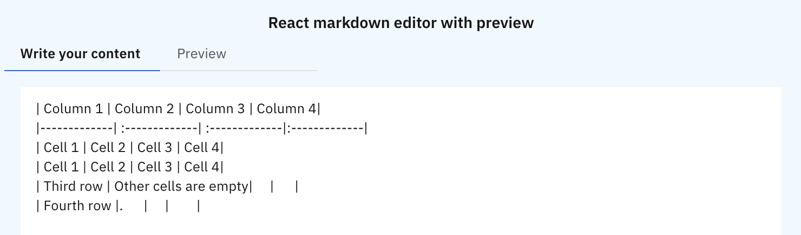
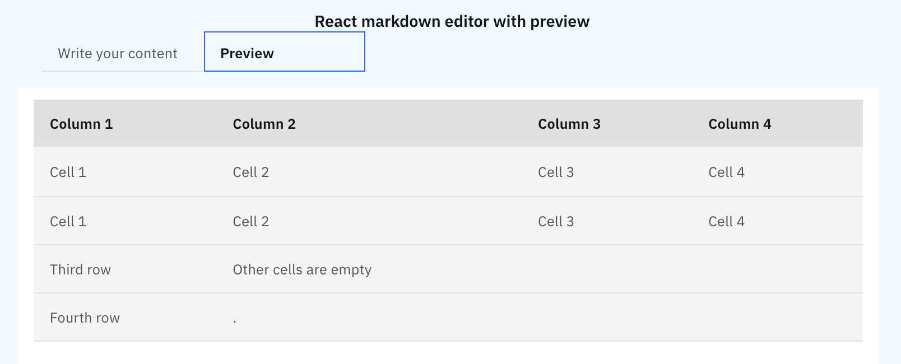

# React markdown editor with preview

This project was bootstrapped with [Create React App](https://github.com/facebook/create-react-app).
This `react-markdown-sample` web app contains markdown editor with preview. Type or paste your markdown here and see its preview. 

## Technology stack
- ReactJS
- Typescript
- Carbon design system

Note: The project uses `yarn` as the package manager. Please install `yarn` on your system before proceeding with next steps. 
## Screenshot of the app
Editor: 
 

Preview: 

## Available Scripts

In the project directory, you can run:

### `yarn install`
This installs the dependent modules that the project depends on.

### `yarn start`

Runs the app in the development mode.\
Open [http://localhost:3000](http://localhost:3000) to view it in the browser.

The page will reload if you make edits.\
You will also see any lint errors in the console.

### `yarn test`

Launches the test runner in the interactive watch mode.\
See the section about [running tests](https://facebook.github.io/create-react-app/docs/running-tests) for more information.

## Learn More

You can learn more in the [Create React App documentation](https://facebook.github.io/create-react-app/docs/getting-started).

To learn React, check out the [React documentation](https://reactjs.org/).
